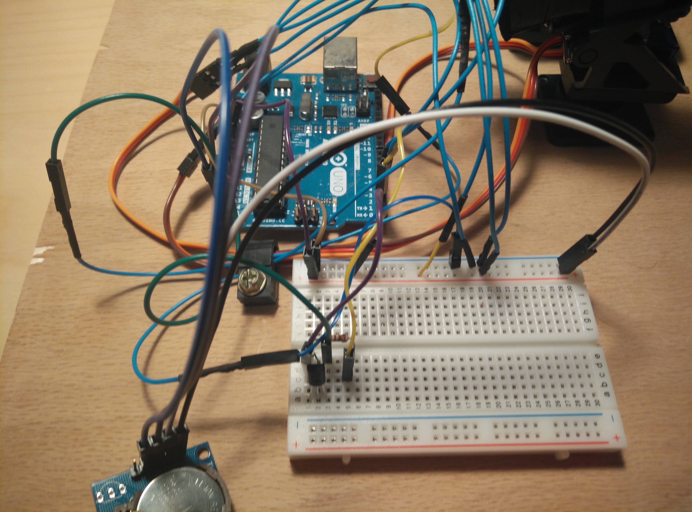
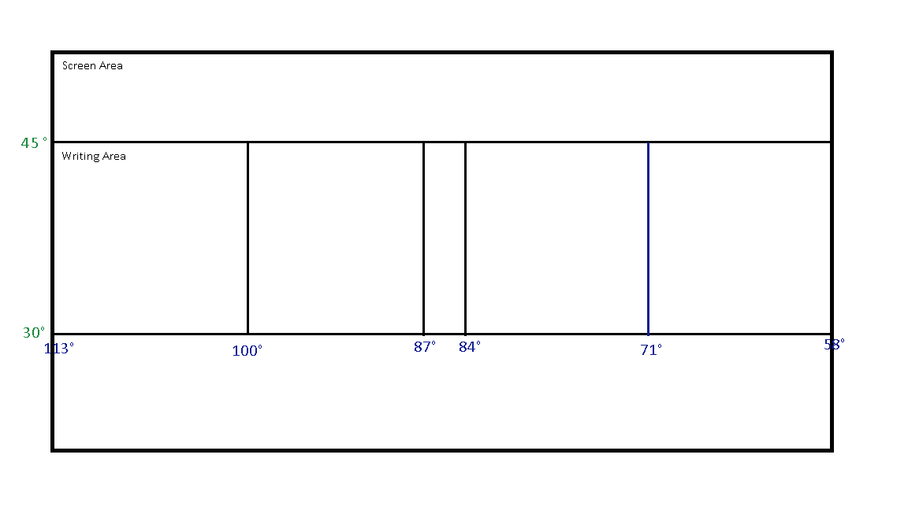

# Time Laser Display

Displays the time in 24hr format on a glow in the dark sticker sheet using an ultraviolet laser. Utilizes x and y servo motors to draw out individual numbers, a tiny RTC to tell the time, and an Arduino UNO for processing. The following videos display how the laser display works in light and dark environments.

<a href="http://www.youtube.com/watch?feature=player_embedded&v=BrsYRhGEyC4
" target="_blank"></a>

<a href="http://www.youtube.com/watch?feature=player_embedded&v=GYEmO1oykZE
" target="_blank"></a>

## Getting Started

This project is programmed on an Arduino UNO, using the [Arduino IDE](https://www.arduino.cc/en/Main/Software "Arduino IDE Download"). The Arduino IDE is based on C/C++.

### Materials Used:

###### Links provided are for convenience/where I got some of my pieces. They do not necessarily reflect the best prices/best places to get parts.

 - [Arduino UNO](https://www.amazon.com/ARDUINO-A000073-DEV-BRD-ATMEGA328/dp/B007R9TUJE/ref=sr_1_5?ie=UTF8&qid=1535558536&sr=8-5&keywords=arduino+uno)(Other UNO boards will most likely work)
 - [Breadboard Jumper Wires](https://www.amazon.com/120pcs-Multicolored-Breadboard-Arduino-Raspberry/dp/B072L1XMJR/ref=sr_1_4?ie=UTF8&qid=1535558804&sr=8-4&keywords=male+female+leads)
 - [Solderless Breadboard](https://us.banggood.com/Wholesale-Warehouse-8_5-x-5_5cm-400-Tie-Points-400-Holes-Solderless-Breadboard-Bread-Board-wp-Usa-91872.html?rmmds=search)
 - [x2 sg90 Micro Servo Motors](https://www.amazon.com/ElectroBot-Micro-Helicopter-Airplane-Controls/dp/B071KJV7DD/ref=sr_1_5?ie=UTF8&qid=1535559351&sr=8-5&keywords=micro+servo+motors)
 - [Mini Pan-Tilt Servo Mount](https://www.amazon.com/Adafruit-Mini-Pan-Tilt-Kit-Assembled/dp/B00PY3LQ2Y/ref=sr_1_fkmr1_1?ie=UTF8&qid=1535559136&sr=8-1-fkmr1&keywords=pan+tilt+servo+motor+mount+adafruit)
 - x1 220 Ohm Resistor
 - [x1 NPN transistor](https://www.amazon.com/gp/product/B06XPWS52G/ref=oh_aui_search_detailpage?ie=UTF8&psc=1)
 - 405nm UV laser pointer
 - [Tiny RTC I2C](https://www.amazon.com/gp/product/B00UUR8GJU/ref=oh_aui_search_detailpage?ie=UTF8&psc=1)
 - [12x12in plexiglass](https://www.amazon.com/gp/product/B004DYW31I/ref=oh_aui_search_detailpage?ie=UTF8&psc=1)
 - [x1 Glow in the Dark Sticker Sheet](https://www.amazon.com/gp/product/B00YU7R3H2/ref=oh_aui_search_detailpage?ie=UTF8&psc=1)
 - 12x18in wooden board
 - USB Data Sync Cable for Arduino UNO

### Other Materials used:
 - block foam
 - electric tape
 - glue gun
 - solder
 - soldering iron
 - heat gun
 - heat shrink tube
 - acrylic and wood binding glue

## Assembly Instructions

### Laser Assembly

There are two types of UV lasers out there: ones with wires and ones without. I recommend getting the ones with wires because that simplifies the assembly process.


I'll be covering the assembly for the regular laser pointer without wires, because that is what I used for my project. The idea behind this assembly is that you want to turn the UV laser from the first image into something like the second image. Firstly, unscrew the laser so you only have the head of the laser. Grab two wires and strip a little bit off both ends; to create attachment pins on either side(you can make any jumper wires work). Take one wire and carefully solder it onto the spring of the laser, this will act as the ground connection. Using some heat shrink and a heat gun, insulate the wire attached to the spring. Take the second wire and press it down onto the laser pointer button, and secure it with electric tape(make sure the button is pressed down).


### Pan and Tilt Servo Mount Assembly

Now that the proper modifications to the laser have been made, it is time to attach the laser to the pan and tilt servo mount. Cut out two pieces(rectangular boxes) of block foam that fit snugly into the top of the servo mount. Carve out a little bit of foam in the center of these two pieces(aiming for a half cylinder shape), this will be where the laser will go. Place the laser in between both pieces of foam, and secure the foam laser sandwich by tightly wrapping tape at the front and back. Once this is done, go ahead and place the foam laser sandwich into the tight space on top of the servo mount.

### Screen Assembly

Secure the bottom portion of the plexiglass using a vice. Heat it up  using a heat gun, and start to slowly bend it backwards. Once the plexiglass is bent at more than a 90 degree angle, or has achieved its desired shape, let it cool. To finish, place a glow in the dark sticker sheet on the front of the plexiglass(on the side facing the laser).


### Board Assembly

Apply acrylic and wood binding glue on one side of the wooden board; place bent portion of the screen to the glue, press down and wait to dry. Place the pan and tilt servo mount with laser attached 9.5in away for the screen(measured from front of mount), and secure using hot glue or screws(the pan and tilt servo mount moves around a lot, so it's important that it's well secured). (Optional) Use some velcro patches to create secure locations for the Arduino UNO, and breadboard behind the laser.


### Wiring

#### Laser
 1. Wire soldered onto the spring is connected to ground.
 2. Wire taped to button is connected to the emitter on the NPN transistor.
 3. The base of the transistor goes through a 220 Ohm resistor, and into pin 1.
 4. The collector is connected to the 5V.

[NPN transistor pin schematic](https://www.onsemi.com/pub/Collateral/PN2222-D.PDF)

#### Micro Servo motors
 - Servo X (responsible for movement along x-axis) attached to pin 2.
 - Servo Y (responsible for movement along y-axis) attached to pin 3.

 

#### Tiny RTC

 - Wiring is the same as in the image provided.


#### End Result


## Programming

### Running tests

Now that the board is assembled, it is important to define the x and y range of the servo mount. Each individual servo can be written an angle from 0 to 180 using the `servo.write()` command. The servo angle reader program provided takes in a value from 0 to 180 in the serial monitor, and writes the servo to that angle. This is useful for running tests to define the screen real estate used for writing out the time.

Provided is a rough diagram of how space is allocated on the screen with regards to the servo angles for the x-axis(blue) and y-axis(green). The four large slots are for numbers in the 24h time format, and the small slot in the center is for the colon.



### Writing numbers

Each number is defined with a certain number of points the servo has to navigate to, to draw out said number. For example, the number 9 has 5 points the servos have to move to with the laser on, to draw out the shape.


Example of code needed to write 9 in the first slot.
```
void nine(){
  servox.write(103);
  servoy.write(32);
  delay(200);
  digitalWrite(laser, HIGH);
  delay(200);
  servoy.write(43);
  delay(200);
  servox.write(110);
  delay(200);
  servoy.write(39);
  delay(200);
  servox.write(103);
  delay(200);
  digitalWrite(laser, LOW);
}
```
Important to note, that this solution only works for my specific setup. The range of the x and y servo angles can vary based on the distance between mount and screen, as well as screen angle. Provided code and instructions would be best used as rough guidelines.

### Libraries Used

 - (cQueue)[ Queue Implementation in C](https://github.com/SMFSW/cQueue)
 - (Servo) Default Servo library
 - (RTClib)[ Tiny RTC library](https://www.elecrow.com/wiki/index.php?title=File:RTC.zip)

### Useful Links

 - [Information on Servos, and their functions.](https://www.arduino.cc/en/Reference/Servo)
 - [Information on programming using the Tiny RTC.](https://www.elecrow.com/wiki/index.php?title=Tiny_RTC)

## Authors

Igor Banin

## Acknowledgments

[Original Inspiration](https://www.reddit.com/r/DIY/comments/6wiorj/made_a_glow_in_the_dark_laser_clock/)
